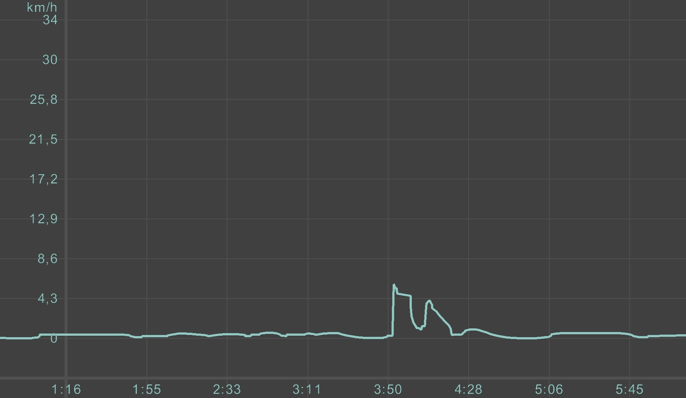

# Speed Conscious
- Due date: 2022-10-27:15:00

Everything is moving. We all uses various speed at different moments depending on the context we must move. We control our speed to get in a specific space and time. What if we were more conscious on the speed we create and use it differently.

## Discussion Feedback:

- animation techniques :static reprenstation, squash and strech 
- develop vocabulary of speed: acceleration, deceleration, feeling.
- speed conscious may involve speed manipulation (*needs speed vocabulary to be more precise.)
- Interaction based on speed.

## Reminder for next pich of wednesday 2022-11-02:
- redo same exercice with more observations(track other people to see what king of graphic is possible to have. The more, the better.).

- Describe one important insight after thoses new observations

- make a new pitch with more precise vocabulary

- Describe in one sentence a story

