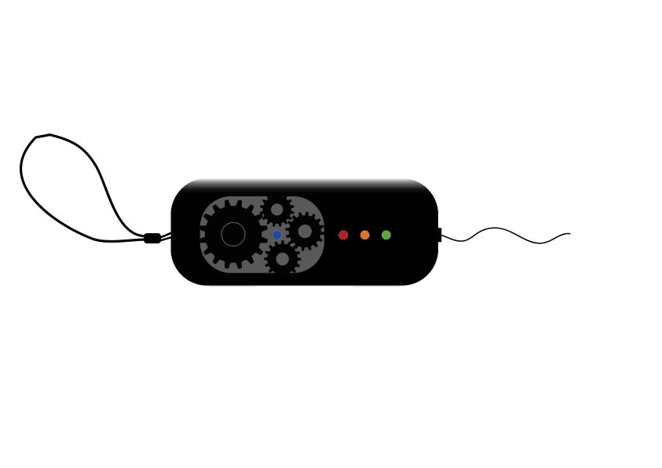
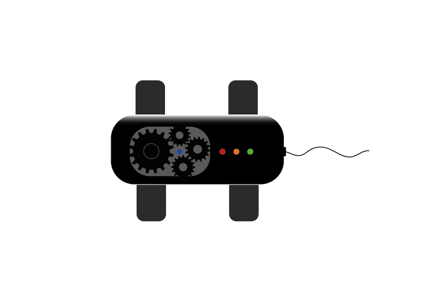
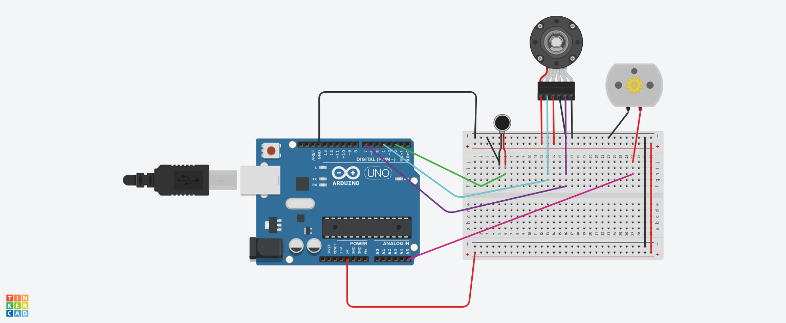
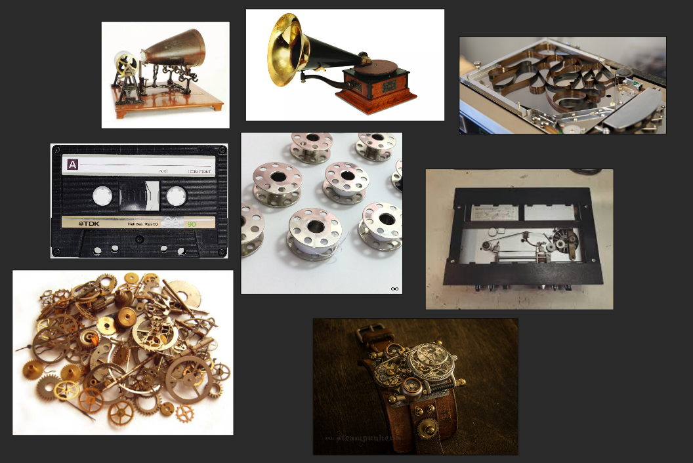
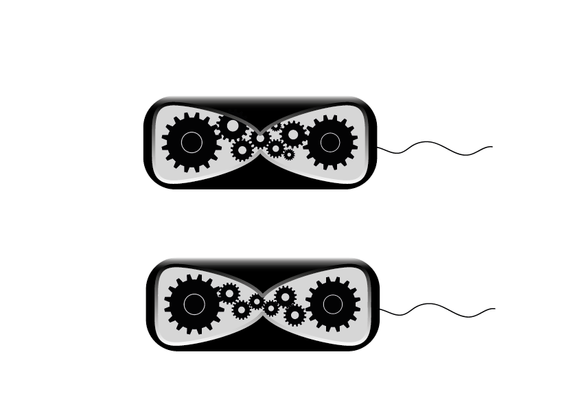
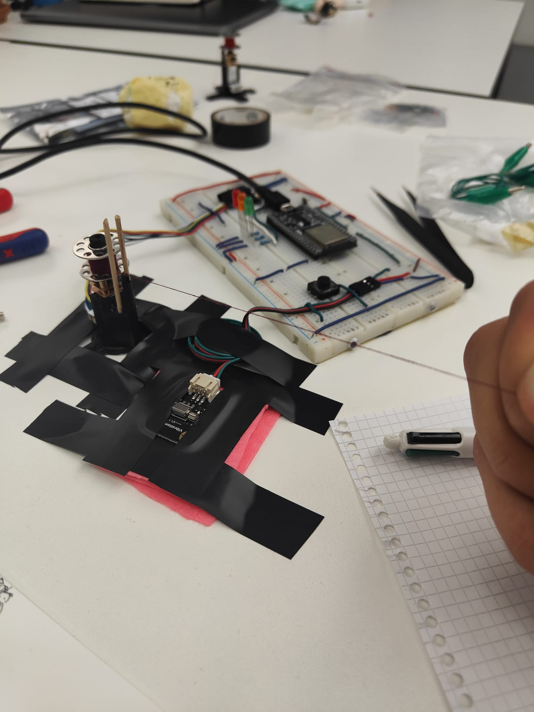

## Final Object Design

## Final Prototype Object Circuit

## PreFinal Object Design

## Circuit

## Design MoodBoard

## First Drawing Gear Hour Glass Design

Feedbacks:

Contradictions, jauge qui ne doit pas
Couper la ficelle ? 
2 joueur ?

- trouver un fil qui pourrait casser ?
- le fil se casse tout seul
- faire un scenario avec le fil sur Twine
- Faire un test A et B 

Moteur:
- Utiliser un driver Motor ? 
- Interupt Entrant = instantanée ( voir exemple sur motoGear). Interupt " YA eu un +1 go faire ça".
- DC motor interupt ? Basé voir la vitesse et déclanché qqch (pwm à la main).
- controler le moteur avec 0 à 255 et checker la force.

