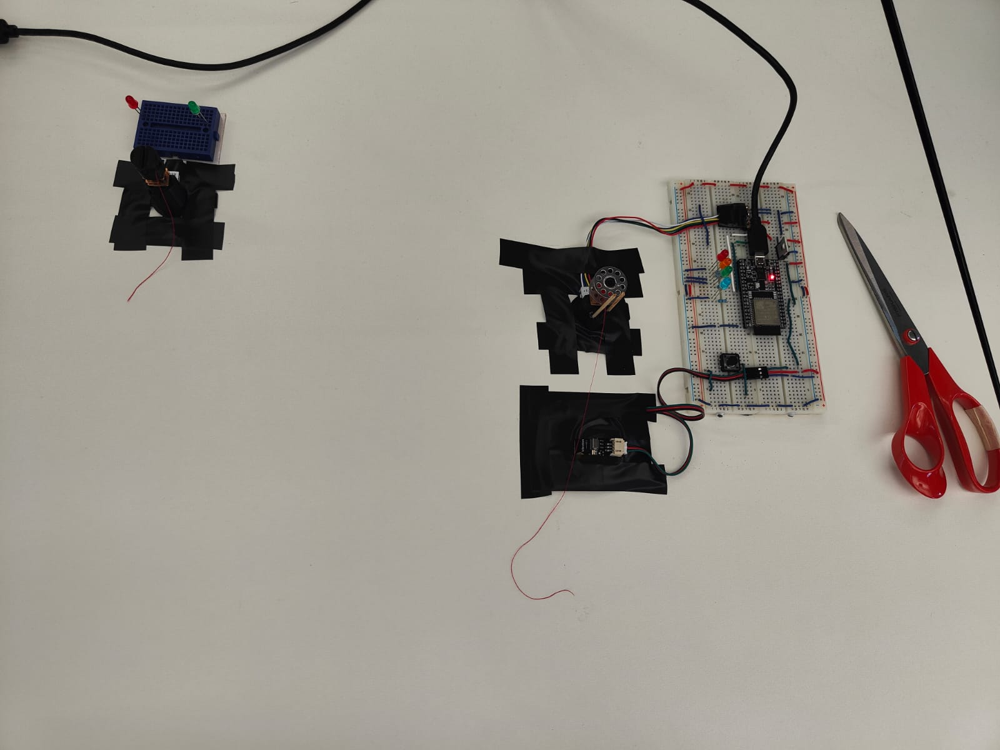

## Test day feedback

## Main feedback

# Interaction: Good points 
- People know they have to pull the string.
- People notice there is a way to pull it longer.
- People understand well the light code.(well, green, orange, red is common sense...)

# Interaction: To improve
- People don't really understand that the two object aren't linked.
- DON'T understand easily that they need a LONGER string.
- Use of Scissor was forgotten most of the time. Implement directly on the object ? Mini Scissor ?

# Interaction: Didn't work
- People didn't wait enough to pass a level step 5sec -> too long. Were stuck. Make it shorter.
- Vibrations hint weren't helping. Most people used leds: green to orange to red. They stop at orange most of the time.
- They understood vibrations as "okay it has finished reset", "I can pull again now".

## Object Setup / Software

# Box
- Use something to make it more clear you can use a new string on it. -> bombine, canette
- Couldn't it be a motor that you turn on ? to animate something gears ?
- Not a box to open.

# Software problems(for me)
- Blocked between 2 state. Red light is stuck in blinking state even if ismoving = false;
- 
