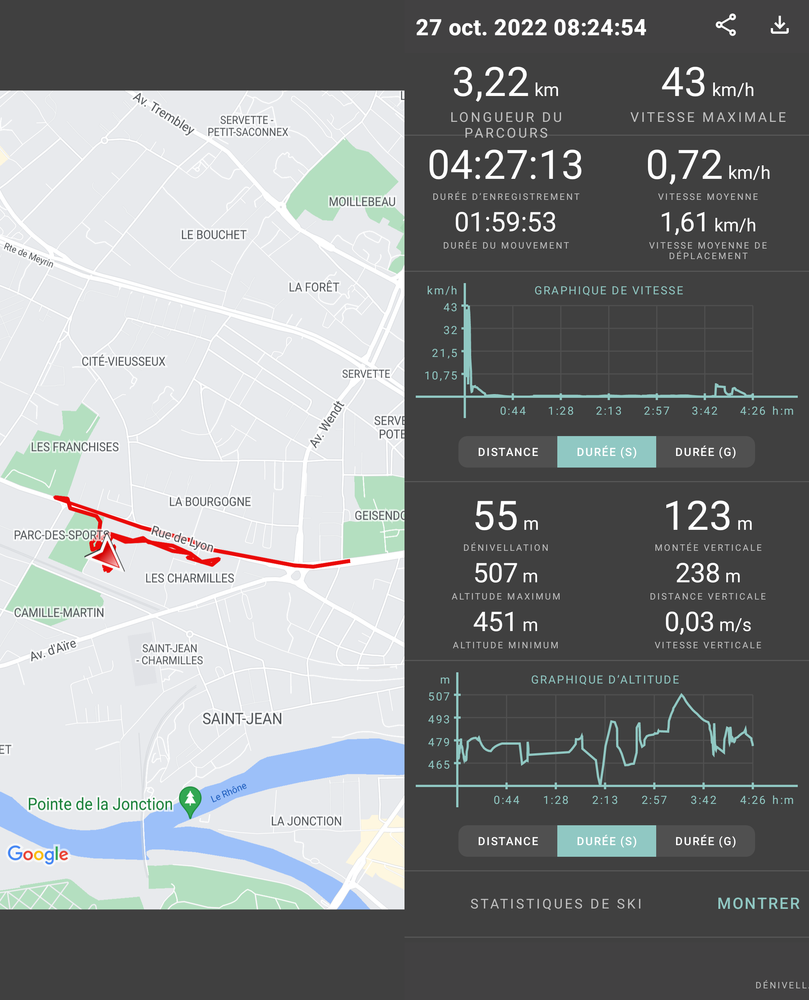

## Time In Time Out Observations
 
## Pattern of Life Analysis

Source:

https://en.wikipedia.org/wiki/Pattern-of-life_analysis

https://cambridge-intelligence.com/pattern-of-life-analysis/

"Pattern-of-life analysis is not limited to one medium and can encompass anything in an individual's (or system of individuals') life: from their internet browsing habits, to a record of instances of choices made in order to determine a statistical favorite".

 "Pattern of life (POL) or behavior pattern describes a recurrent (e.g., normalcy) way of acting by an individual or group toward a given object or in a given situation. Usually, one has a specific POL, and this POL is repeatable".

 

 By checking at what time people sends email you can know their working time and the others that continues to work after work.

## My position and speed patterns

Our time habits may be represented by position and speed.
We all have a routine, habits. We time control. 

Here are some data of "speed" routine.

1) Lausanne lane 5 to 7:
- Dist: 160m
- Time : 2min
- Average Speed: 3km

2) Train Lausanne to Vufflens:
- Dist: 11.20km
- Time : 12:30m
- Average Speed:65km/h

3) TrainStation to Mom's car
- Dist: 90m
- Time: 1m
- Average Speed: 4km/h

4) (Car) Mom's car to home
- Dist: 1.28 km
- Time: 3:08
- Average Speed: 27km/h

Realised I have not enough data. I looked for another app.

- I can record the entire day and get a graph
- Data from 8h30 to 13h

## Butterfly effect || Causality

"In chaos theory, the butterfly effect is the sensitive dependence on initial conditions in which a small change in one state[...]can result in large differences in a later state." - Wiki

How do we experience the domino effect in our life habits and how a sequence of events in time can results to something not wanted or unpredictable.

 ## Pattern, Speed, Causality okay but why ?

 - How different time speed can predict certains action ?
 - With a simple succesion of mouvement can you guess what people are   doing ?
 - How to create a story evolving with a succesion of movement.
